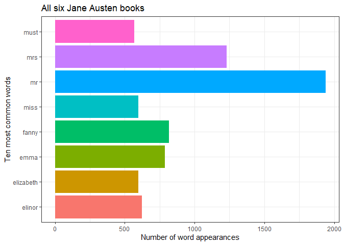
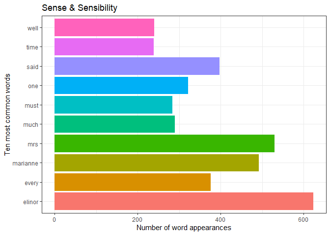

Assignment_B4
================
Jérôme Plumier
2023-12-07

# Option A - Strings and functional programming in R

For the completion of the fourth assignment for STAT545B, option A was
chosen. To complete option A, exercise 1 and exercise 2 will be done.

First, let’s load some libraries we will use.

``` r
library(tidyverse)
```

    ## ── Attaching core tidyverse packages ──────────────────────── tidyverse 2.0.0 ──
    ## ✔ dplyr     1.1.3     ✔ readr     2.1.4
    ## ✔ forcats   1.0.0     ✔ stringr   1.5.0
    ## ✔ ggplot2   3.4.3     ✔ tibble    3.2.1
    ## ✔ lubridate 1.9.2     ✔ tidyr     1.3.0
    ## ✔ purrr     1.0.2     
    ## ── Conflicts ────────────────────────────────────────── tidyverse_conflicts() ──
    ## ✖ dplyr::filter() masks stats::filter()
    ## ✖ dplyr::lag()    masks stats::lag()
    ## ℹ Use the conflicted package (<http://conflicted.r-lib.org/>) to force all conflicts to become errors

``` r
library(dplyr)
library(tidytext)
```

    ## Warning: le package 'tidytext' a été compilé avec la version R 4.3.2

``` r
library(ggplot2)
library(stringr)
library(roxygen2)
library(testthat)
```

    ## 
    ## Attachement du package : 'testthat'
    ## 
    ## L'objet suivant est masqué depuis 'package:dplyr':
    ## 
    ##     matches
    ## 
    ## L'objet suivant est masqué depuis 'package:purrr':
    ## 
    ##     is_null
    ## 
    ## Les objets suivants sont masqués depuis 'package:readr':
    ## 
    ##     edition_get, local_edition
    ## 
    ## L'objet suivant est masqué depuis 'package:tidyr':
    ## 
    ##     matches

## Exercise 1 - Most common words (37.5 points)

For the completion of exercise 1, we shall use the Jane Austen books,
using the `janeaustenr` and `stopwords`package.

``` r
library(janeaustenr)
```

    ## Warning: le package 'janeaustenr' a été compilé avec la version R 4.3.2

``` r
library(stopwords)
```

    ## Warning: le package 'stopwords' a été compilé avec la version R 4.3.2

Now, we create our new dataframe `books_words` that contains Jane
Austen’s 6 books.

``` r
books<-austen_books() # Place all 6 books in a books dataframe

# Make a new dataframe where each observation is a single word
books_words <- unnest_tokens(books,            # Select our Jane Austen book dataframe
                             word,            # Name the output as words
                             text,             # Input is the variable named text
                             token = "words",  # Name the output words
                             to_lower = TRUE,  # Make all words lower case
                             drop = TRUE)      # Drop the original text variable
head(books_words)
```

    ## # A tibble: 6 × 2
    ##   book                word       
    ##   <fct>               <chr>      
    ## 1 Sense & Sensibility sense      
    ## 2 Sense & Sensibility and        
    ## 3 Sense & Sensibility sensibility
    ## 4 Sense & Sensibility by         
    ## 5 Sense & Sensibility jane       
    ## 6 Sense & Sensibility austen

This permits us to create another dataframe named `stopwords_austen`
with all the English stopwords provided by the `stopwords`package
removed. We can see, comparing with the previous `head()` function
results, that the stopwords were removed.

``` r
stopwords_austen <- books_words %>%
  filter(!word %in% stopwords("en"))
head(stopwords_austen)
```

    ## # A tibble: 6 × 2
    ##   book                word       
    ##   <fct>               <chr>      
    ## 1 Sense & Sensibility sense      
    ## 2 Sense & Sensibility sensibility
    ## 3 Sense & Sensibility jane       
    ## 4 Sense & Sensibility austen     
    ## 5 Sense & Sensibility 1811       
    ## 6 Sense & Sensibility chapter

To obtain our finalised dataframe, we now want to add the count of each
words.

``` r
count_austen <- stopwords_austen %>%
  group_by(book, word) %>%
  summarise(.groups="keep", n=n()) 
tail(count_austen)
```

    ## # A tibble: 6 × 3
    ## # Groups:   book, word [6]
    ##   book       word          n
    ##   <fct>      <chr>     <int>
    ## 1 Persuasion youth        15
    ## 2 Persuasion youthful      1
    ## 3 Persuasion z             1
    ## 4 Persuasion zeal          5
    ## 5 Persuasion zealous       2
    ## 6 Persuasion zealously     1

We can now plot the most common words. For the sake of legibility, we
will plot only the ten most common words. We will use as an example all
six books first:

``` r
plot_austen <- ggplot(data = (count_austen %>%
  arrange(desc(n)) %>% head(n=10))) +
  geom_bar(aes(y=word, x=n, fill = word), stat= "identity") +
  theme_bw() +
  theme(legend.position="none") +
  ylab("Ten most common words") +
  xlab("Number of word appearances")+
  ggtitle("All six Jane Austen books")
plot_austen
```

<!-- -->

And as another example, here we looked at the ten most common words in
the `Sense & Sensibility` book:

``` r
plot_austen_SandS <- ggplot(data = (count_austen %>%
  filter(book =="Sense & Sensibility") %>%
  arrange(desc(n)) %>% head(n=10))) +
  geom_bar(aes(y=word, x=n, fill = word), stat= "identity") +
  theme_bw() +
  theme(legend.position="none") +
  ylab("Ten most common words") +
  xlab("Number of word appearances")+
  ggtitle("Sense & Sensibility")
plot_austen_SandS
```

<!-- -->

## Exercise 2 - Pig Latin function (37.5 points)

This section will be further divided into three subsections.

### Exercise 2.1: Make a function

Let’s first create a function that will convert words into my own Pig
Latin version, and document it using `roxygen2`.

It has a rearrangement component: For words that end with a vowel, that
vowel is duplicated at the beginning of the word sequence. In all other
cases, the end of a word sequence from its last vowel onward is placed
at the beginning of the word sequence.

It has an addition component: All words receive a “o” that follows the
new added beginning of the word sequence, and a “y” that comes at the
new end of the word sequence.

``` r
pigLatin <- function(input) {
  
  if(!(is.character(input))) {
    stop('The word sequence needs to be inputed as a string.')}
  if(!grepl("^[A-Za-z]+$", input)) {
    stop('The word sequence needs to be made out of letters only (no space).')}

  input<-tolower(input)
  vowel_position <- grep("[aeiouy]", strsplit (input, NULL)[[1]])

  if(length(vowel_position)==0){
    stop('The word sequence contains no vowel.')}
  consonant_check <- grep("[zrtpqsdfghjklmwxcvbn]", strsplit (input, NULL)[[1]])
  if(length(consonant_check)==0){
    stop('The word sequence contains only vowels.')}

  vowel_position <- tail(vowel_position, 1)
  if(str_sub(input, start=-1)=="vowel_position"){
    str_c(str_sub(input, start = vowel_position), "o", str_sub(input, start = 1L, end = 1L), "y") 
  }else{
    str_c(str_sub(input, start = vowel_position), "o", str_sub(input, start = 1L, end = vowel_position-1), "y")
  }
}

#' @title Transform a singular word into its pig Latin equivalent
#' 
#' @description Given a string of letters, this function will return a pig Latin
#' word sequence based on personal rules: For words that end with a vowel, that
#' vowel is duplicated at the beginning of the word sequence. In all other 
#' cases, the end of a word sequence from its last vowel onward is placed at
#' the beginning of the word sequence. Moreover, all words receive a "o" that
#' follows the new added beginning of the word sequence, and a "y" that comes
#' at the end of the new word sequence.
#' 
#' @param input, a string. It must be composed solely out of letters, and
#' contain both at least one vowel and one consonant.
#' 
#' @return a new word sequence with only lower case letters. It is the 
#' inputed string modified by personal pig Latin rules.
#' 
#' @export
```

### Exercise 2.2: Function examples

Here is an example of using the function to transform the word`hello`,
which ends with a vowel:

``` r
test1 = "hello"
pigLatin(test1)
```

    ## [1] "oohelly"

Here is an example of using the function to transform the
word`transform`, which ends with a consonant:

``` r
test2 = "transform"
pigLatin(test2)
```

    ## [1] "ormotransfy"

Here is an example of using the function to transform the
word`HAMBURGER`, with only capital letters:

``` r
test3 = "HAMBURGER"
pigLatin(test3)
```

    ## [1] "erohamburgy"

### Exercise 2.3: Function tests

For this exercise, I tested my function using the `expect_error()`
function from the `testthat` package with non-redundant inputs. They all
passed:

``` r
test_that('Not a string', {
x=c("a", "b", "c")
expect_error(pigLatin(x))
})
```

    ## Test passed 🥳

``` r
test_that('Only one word', {
x="Hello world"
expect_error(pigLatin(x))
})
```

    ## Test passed 🎉

``` r
test_that('The string is only made out of letters', {
x="Hello1"
expect_error(pigLatin(x))
})
```

    ## Test passed 🌈

``` r
test_that('The string has at least one consonant', {
x="aeouiy"
expect_error(pigLatin(x))
})
```

    ## Test passed 🎉

``` r
test_that('The string has at least one vowel', {
x="zrtpqsdfg"
expect_error(pigLatin(x))
})
```

    ## Test passed 🎉
